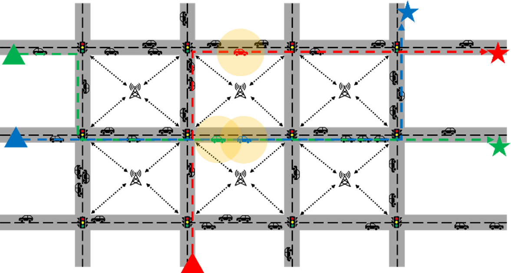
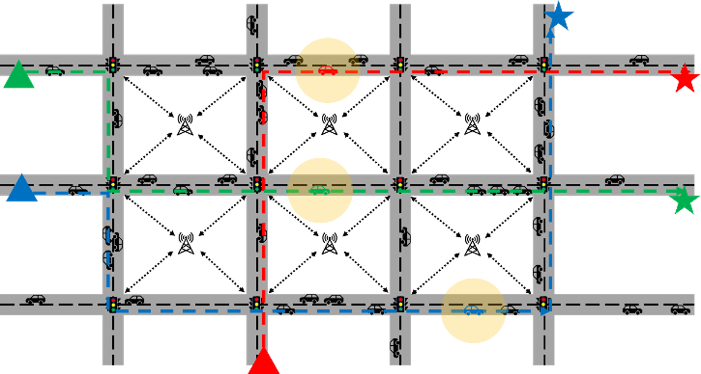
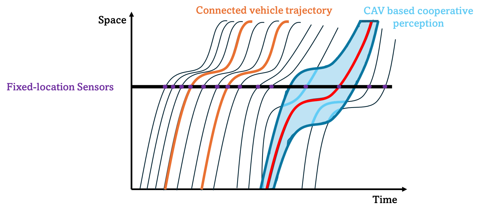
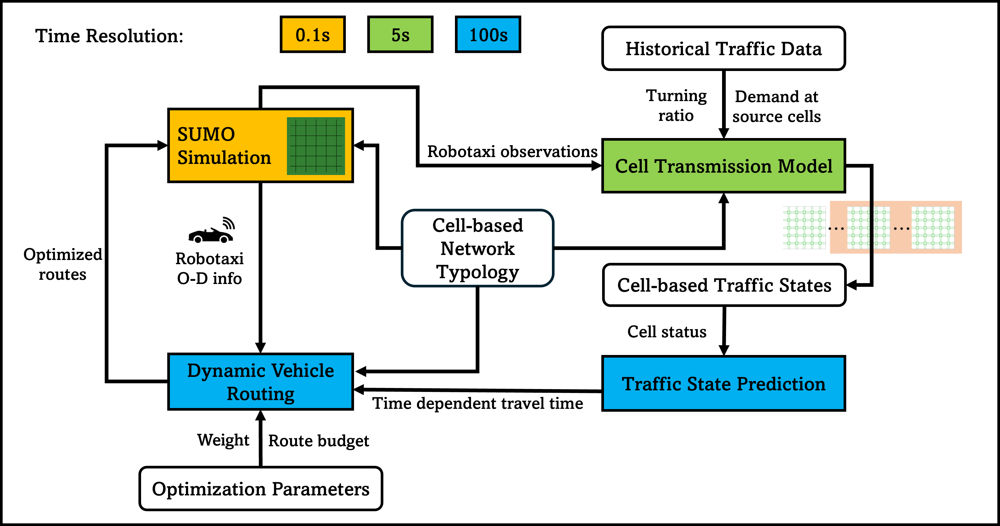
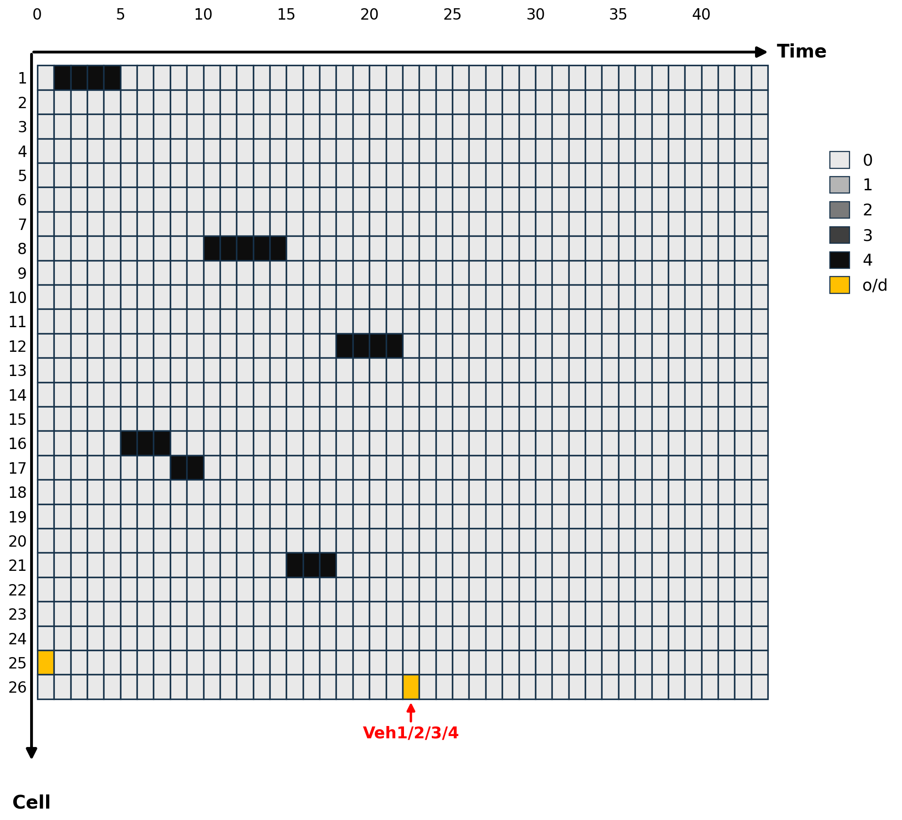
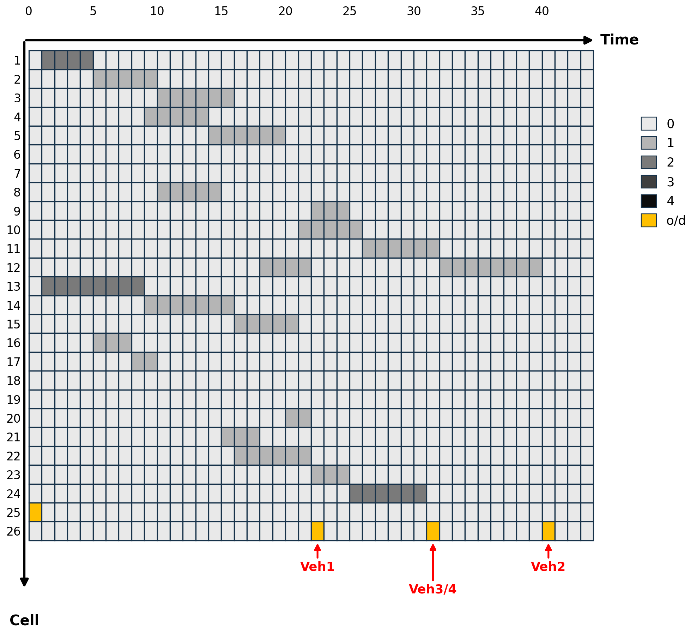
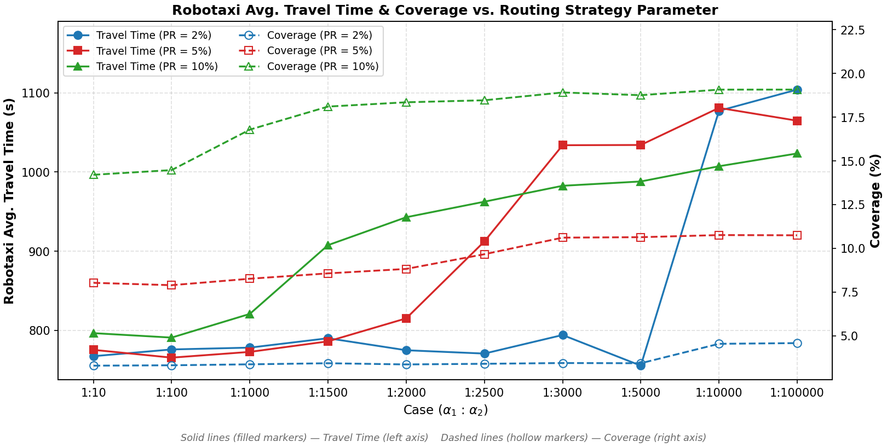
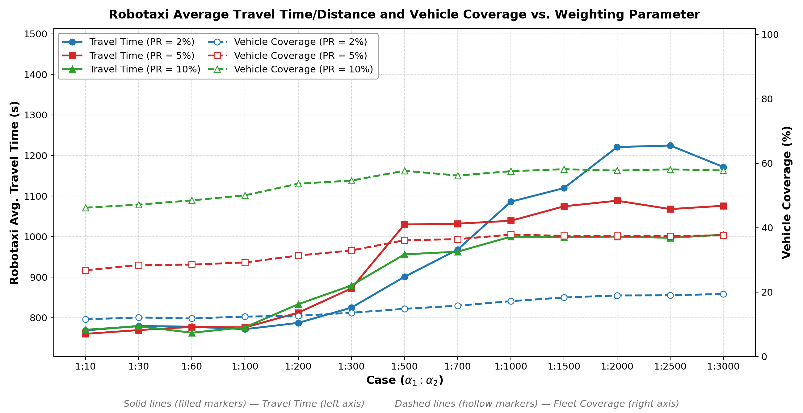

# RoboSense

**Leveraging robotaxi fleets as drive-by sensors for urban traffic monitoring.**

> 📄 **Paper:** [RoboSense: Leveraging Robotaxi Fleets as Drive-by Sensors for Urban
> Traffic Monitoring](paper/TRC-26-03199.pdf) — submitted to *Transportation Research
> Part C* (TRC-26-03199), under review.
> Yilin Wang, Yiheng Feng · Purdue University

Robotaxis are dispatched to carry passengers. But a centrally controlled fleet can do
a second job at the same time: while driving, it *sees* traffic. RoboSense is a
dynamic routing framework that turns that side effect into an explicit objective —
routes are chosen to trade off passenger travel time against how much of the network
the fleet observes, in space and in time.

This repository contains the full implementation, the case-study configuration, and
the submitted manuscript.

**Contents** · [The idea](#the-idea) · [How it works](#how-it-works) ·
[The objective](#the-objective) · [Case study](#case-study) · [Results](#results) ·
[Install](#installation) · [Reproduce the paper](#reproducing-the-paper)

---

# The idea

## Routing a fleet for what it can see

A fleet routed purely on travel time collapses onto the same fast corridors. Every
vehicle traverses the same links at the same time, so the data it collects is
redundant — a lot of vehicles, very little of the network.

Route the same fleet with monitoring in the objective and it spreads out. Total
travel time goes up somewhat, but the fleet now observes a much larger slice of the
network.

| Routing on travel time alone | Routing that also values monitoring |
|---|---|
|  |  |

*Four vehicles, same origins and destinations. Left: all take the same shortest path.
Right: routes diversify to cover more of the network.*

## Where drive-by sensing sits

Traffic monitoring data comes in three flavours, and they trade off differently in
space and time:



- **Fixed-location sensors** (loops, cameras) — temporally continuous, spatially sparse.
- **Probe vehicles** — spatiotemporally continuous, but only for the probe itself.
- **Perception sensors on CAVs / robotaxis** — capture *many* surrounding vehicles at
  once, forming a cooperative perception environment.

That third mode is why a robotaxi fleet is interesting: because each vehicle observes
its neighbours rather than just itself, useful network coverage arrives at a far lower
market penetration rate than probe-vehicle approaches need. And unlike privately owned
vehicles, a robotaxi fleet is *centrally dispatched* — so its routes can actually be
coordinated.

# How it works



Three components run at different time resolutions and feed each other:

| Component | Resolution | Role |
|---|---|---|
| **SUMO simulation** | 0.1 s | Microscopic traffic; background vehicles + robotaxis |
| **Cell Transmission Model** | 5 s | Estimates *and predicts* cell-level traffic state |
| **Dynamic Vehicle Routing** | 100 s | MILP over a rolling horizon; emits new routes |

**Cell-based network representation.** Every link is split into cells sized to match
a robotaxi's detection range (80 m). One representation serves three purposes at once:
it defines what counts as *observed* (a cell with a robotaxi in it), it is the
discretization the CTM runs on, and it is the unit the monitoring metric counts.

**Traffic state prediction.** The CTM runs alongside SUMO, correcting itself with
robotaxi observations and historical turning ratios, and runs *ahead* of it to predict
cell densities over the planning horizon. Those predictions become the time-dependent
travel costs the routing model optimizes against.

**Dynamic routing.** A MILP picks routes for every robotaxi over the horizon, then a
rolling-horizon scheme re-solves as conditions change. Better coverage improves the
state prediction, which improves the next routing decision — the loop closes.

# The objective

Both formulations minimize the same expression. They differ only in how a covered
cell is weighted:

```
min   (α₁/|A|) · Σₐ Σᵢ,ₜ cᵢᵗ · xᵢ,ₜᵃ   −   α₂ · COVERAGE / (|I|·|T|)
      └────────── total travel time ──────────┘   └──── monitoring ────┘
```

| `coverage_objective` | COVERAGE | Behaviour |
|---|---|---|
| `'cell'` | `Σᵢ,ₜ yᵢᵗ` | Every covered cell counts once — rewards spreading out |
| `'vehicle_count'` | `Σᵢ,ₜ nᵢᵗ · yᵢᵗ` | Cells weighted by predicted vehicle count — rewards observing *vehicles* |

`yᵢᵗ` is binary: is cell `i` observed at step `t`. `nᵢᵗ` is the CTM-predicted vehicle
count, which enters as a **constant** coefficient — so the vehicle-weighted variant is
still an MILP with identical variables and constraints.

`α₂` is the dial. Raising it buys coverage at the cost of travel time.

## What the objective actually does

The clearest way to see it is a toy network with four robotaxis, plotting which cell
is occupied at which time step:

| `α₁:α₂ = 1:0` — travel time only | `α₁:α₂ = 1:10⁶` — monitoring emphasized |
|---|---|
|  |  |

*Rows are cells, columns are time steps; shading is how many vehicles are in that cell.
Left: the four vehicles stack onto identical cells at identical times — dark bands,
mostly empty grid. Right: they fan out across distinct cells, filling far more of the
space-time grid with the same four vehicles.*

# Case study


| | |
|---|---|
| Network | 5×5 grid — 40 bidirectional two-lane links, 25 four-approach intersections |
| Geometry | 400 m between intersections; 20 entry/exit links of 240 m |
| Signals | Fixed-time plans at every intersection |
| Robotaxi MPR | 2%, 5%, 10% |
| Simulation | 5400 s in SUMO, with a fixed-time signal plan and calibrated CTM |
| Weights | `α₂` swept across three orders of magnitude |

# Results



*Solid lines with filled markers: average robotaxi travel time (left axis). Dashed
lines with hollow markers: network coverage (right axis). Blue/red/green = 2%/5%/10% MPR.*

**Coverage responds to the weight.** Across every MPR, pushing `α₂` up moves coverage
up. Including spatiotemporal coverage in the objective does what it is meant to do.

**Penetration rate dominates.** 10% MPR reaches roughly 19% network coverage; 2% MPR
plateaus near 5%. More sensors beat cleverer routing — but at a *fixed* fleet size,
routing still buys a substantial improvement for free.

**The win-win.** The paper's most interesting finding is that the trade-off is not
strictly monotonic. In the authors' words:

> Interestingly, with appropriate weights between the two objectives, monitoring
> performance and robotaxi average speed can be improved simultaneously. This suggests
> better network monitoring leads to more accurate traffic state prediction and
> improved mobility.

That matters commercially: if better sensing also makes the fleet *faster*, a robotaxi
operator has a reason to opt in rather than being regulated into it.

## Weighting cells by how many vehicles are in them

Covering an empty cell and covering a congested one count the same under `'cell'`.
The vehicle-weighted objective fixes that:



Routes are pulled toward congested cells, which raises *vehicle* coverage across all
MPRs — the fleet observes more actual vehicles for the same fleet size. Travel time
becomes more dispersed than under the original objective, because robotaxis are now
deliberately routed into slower, busier links.

---

# Using the code

## Repository layout

```
src/
  config.py                 # all run settings live here (see Configuration)
  main_ctm.py               # single simulation run entry point
  simulation.py             # SUMO/TraCI loop, CTM stepping, routing calls
  utili/
    routeOptimGurobi.py     # the MILP: variables, constraints, objective
    ctm/                    # cell transmission model
    network.py, tools.py    # network handling and helpers
  od_generator/             # demand / OD generation scripts
  turn-defs/                # turn ratio generation
  data_analysis/
    popularity_rerun.py     # batch runner: cell-coverage objective (Sec. 4.2)
    nweight_rerun.py        # batch runner: vehicle-weighted objective (Sec. 4.3)
    FdCalibrator.py         # fundamental diagram calibration
sumo_cfg/
  5x5net/                   # the 5x5 grid network, signals, detectors, CTM config
    od/flow*/               # per-MPR demand scenarios (2% / 5% / 10%)
  toy_net/                  # small network used for the illustrative example
analysis/                   # result analysis and plotting
docs/img/                   # figures used in this README
paper/                      # the submitted manuscript
result/                     # aggregated results only -- see Data
```

## Requirements

| | Version tested | Notes |
|---|---|---|
| Python | 3.12 | |
| SUMO | 1.19+ | `sumo` on PATH; `SUMO_HOME` set |
| Gurobi | 11.0.3 | **license required**, see below |

Python packages: numpy, pandas, scipy, networkx, matplotlib, seaborn,
scikit-learn, gurobipy, traci, sumolib.

### Gurobi license

The routing model is a MILP solved with Gurobi, so you need a license.

- **Academic users**: Gurobi issues free named-user academic licenses.
- **Everyone else**: the free size-limited license is enough for the **toy
  network** example, but *not* for the 5x5 grid case study — those models exceed
  its variable/constraint limits. Plan on a full license to reproduce the paper.

## Installation

```bash
# 1. SUMO (Ubuntu; see sumo.dlr.de for other platforms)
sudo apt install sumo sumo-tools
export SUMO_HOME=/usr/share/sumo        # add to your shell profile

# 2. Python environment
conda env create -f environment.yml
conda activate robosense

# 3. Gurobi license
grbgetkey <your-license-key>            # or place gurobi.lic per Gurobi's docs
```

Verify:

```bash
sumo --version
python -c "import gurobipy; gurobipy.Model('ok'); print('gurobi ok')"
```

## Quickstart

All scripts resolve paths relative to `src/`, so run them from there.

> **Before your first routing run** you need to generate the CTM ground truth
> once — see [First-time setup](#first-time-setup-ctm-ground-truth). Without it
> every routing run stops immediately with a `FileNotFoundError` on
> `bench/ctm_gt.npy`.

The fastest way to confirm a working setup is one case of the batch runner. It
installs the demand scenario, runs the simulation, and cleans up after itself:

```bash
cd src
python data_analysis/popularity_rerun.py --mode probe
```

To run `main_ctm.py` directly instead, first install one of the per-MPR demand
scenarios, since the simulation config reads `od_mixed.rou.xml`:

```bash
cd sumo_cfg/5x5net
cp "od/flow350(7)_7200s_2percent/od.rou.xml" od_mixed.rou.xml       # 2% MPR
cp "od/flow350(7)_7200s_2percent/turnRatios.add.xml" turnRatios.add.xml
cd ../../src
python main_ctm.py
```

Both write to the `saving_dir` configured in `config.py`. For the 10% scenario
use its `od_mixed.rou.xml` rather than `od.rou.xml`.

## First-time setup: CTM ground truth

The CTM runs in `dynamic` demand mode, which reads a per-scenario ground-truth
occupancy array `bench/ctm_gt.npy`. These arrays are simulation output (~6 MB
each) and are **not** distributed with the repository, so you generate them once
before the first routing run. Without them you will see:

```
FileNotFoundError: .../result/ctmResult/logs/ctm_test1/<tag>/<case>/bench/ctm_gt.npy
```

A benchmark run is just the same simulation with routing switched off, so it
needs no ground truth to produce one.

**Step 1 — install the demand scenario you are generating for.** From
`sumo_cfg/5x5net/`, for the 2% case:

```bash
cp "od/flow350(7)_7200s_2percent/od.rou.xml" od_mixed.rou.xml
cp "od/flow350(7)_7200s_2percent/turnRatios.add.xml" turnRatios.add.xml
```

**Step 2 — switch `src/config.py` into benchmark mode.** The batch runners look
for the ground truth under the `1215test` tag (`BENCH_SRC_TAG` in
`nweight_rerun.py`), so write it there:

```python
self.is_real_demand = 'static'   # static demand needs no ground truth
self.is_bench       = True       # disable the routing optimization
self.is_route       = False
self.test_str       = 'ctm_test1'
self.case_str       = '1215test/350_5400s_2percent_new_normVeh'
self.senario_str    = 'bench'    # writes <case_str>/bench/ctm_gt.npy
```

**Step 3 — run it.**

```bash
cd src && python main_ctm.py
```

This writes `result/ctmResult/logs/ctm_test1/1215test/350_5400s_2percent_new_normVeh/bench/ctm_gt.npy`,
which is exactly where the routing runs look for it.

**Step 4 — repeat** for each scenario you intend to run, changing both the OD
files in step 1 and `case_str` in step 2:

| Scenario | OD folder | `case_str` suffix |
|---|---|---|
| 2% | `flow350(7)_7200s_2percent` | `350_5400s_2percent_new_normVeh` |
| 5% | `flow350(17)_7200s_5percent_new` | `350_5400s_5percent_new_normVeh` |
| 10% | `flow350(35)_7200s_10percent_new` | `350_5400s_10percent_new_normVeh` |
| 10%, no budget | `flow350(35)_7200s_10percent_new` | `350_5400s_10percent_nobgt_new_normVeh` |

The 10% folder has an explicit `od_mixed.rou.xml`; use that instead of
`od.rou.xml`. The no-budget case uses the same demand as 10%, so if you already
generated that one you can simply copy its `ctm_gt.npy` across.

**Step 5 — restore** `is_real_demand = 'dynamic'`, `is_bench = False`,
`is_route = True` before doing any routing runs.

You only need the scenarios you actually plan to run. `provision_bench_gt()` in
the batch runners copies these from `1215test` into their own output tree and
never overwrites an existing file.

## Reproducing the paper

Two batch runners, one per objective formulation. Each pins its own
`coverage_objective`, so you do not need to edit `config.py` to switch between them.

```bash
cd src

# Grid Network Analysis (Sec. 4.2) -- cell-coverage objective
python data_analysis/popularity_rerun.py --mode probe          # 1 case, smoke test
python data_analysis/popularity_rerun.py --mode parallel --workers 12

# Vehicle Number Weighted Monitoring Objective (Sec. 4.3)
python data_analysis/nweight_rerun.py --mode probe
python data_analysis/nweight_rerun.py --mode parallel --workers 12
```

Useful flags: `--phases 2percent,5percent` to run a subset of MPRs,
`--skip-existing` to resume an interrupted sweep, `--no-nobgt` to skip the
no-budget cases.

**Start with `--mode probe`.** A full sweep is large: `nweight_rerun.py` runs 52
cases (3 MPRs x 13 `alpha_2` values, plus 13 no-budget cases) and
`popularity_rerun.py` runs 40. Each case is a 5400-second SUMO simulation with a
MILP re-solved on a rolling horizon, so a full sweep is hours of compute on a
many-core machine, and `--workers 12` will use substantial RAM.

## Configuration

Everything is in `src/config.py`. The settings that matter most:

| Setting | Meaning |
|---|---|
| `coverage_objective` | `'cell'` = coverage term `sum(y_i^t)`; `'vehicle_count'` = `sum(n_i^t * y_i^t)` |
| `param` | `(alpha_1, alpha_2, M)` — travel-time weight, coverage weight, big-M |
| `budget` | de-routing budget per robotaxi; `0` restricts to shortest paths |
| `opt_interval` | re-optimization interval in seconds |
| `sumo_maxtime` | simulation horizon |
| `is_route` | `False` disables routing control (benchmark runs) |

See [The objective](#the-objective) above for what the two `coverage_objective`
settings mean.

## Data

This repository tracks **code, network definitions, and case-study
configuration** — everything needed to *re-run* the experiments. Raw SUMO output
(per-vehicle, per-step dumps) is not tracked: it is hundreds of megabytes and fully
regenerable from the configuration here. Aggregated results are kept.

See [`DATA.md`](DATA.md) for the exact tracked/untracked breakdown.

## Citation

The manuscript is under review at *Transportation Research Part C* (TRC-26-03199);
the submitted version is included here as
[`paper/TRC-26-03199.pdf`](paper/TRC-26-03199.pdf).

Until it appears, please cite the software entry in
[`CITATION.cff`](CITATION.cff). Volume, year, and DOI will be added here on
publication.

## License

MIT — see [`LICENSE`](LICENSE).

Note that the dependencies carry their own terms: SUMO is EPL-2.0, and **Gurobi is
commercial software requiring a separate license**. Neither is redistributed here.

Figures in this README are from the submitted manuscript and are covered by the same
license as the rest of the repository.

## Authors

Yilin Wang (<wang4517@purdue.edu>), Yiheng Feng (<feng333@purdue.edu>)
Lyles School of Civil and Construction Engineering, Purdue University
